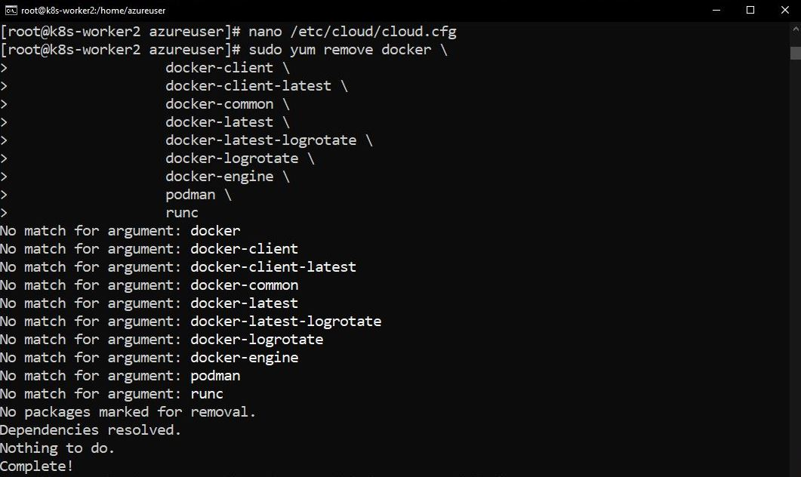

<div align="center">
  <h3 align="center">Devops Engineering - Bare Metal Kubernetes</h3>

  <p align="center">
    A setup for a kubernetes cluster with deploying airbyte.
    <br />
    <strong>Explore the docs »</strong>
    <br />
    <br />
    
  </p>
</div>


<details id="#contents">
  <summary>Table of Contents</summary>
  <ol>
   <ul>
        <li><a href="#prerequisites">Common kubernetes setup for all nodes</a></li>
        <li><a href="#installation">Configuration for Master node and creating the cluster</a></li>
        <li><a href="#prerequisites">Joining worker nodes to the cluster</a></li>
        <li><a href="#installation">Configuring helm</a></li>
        <li><a href="#installation">Deploying Airbyte</a></li>
   </ul>
  </ol>
</details>

<strong>BEFORE PROCEEDING MAKE SURE YOU ARE USING ROOT USER</strong>

```sh
sudo su
```

<h2>Common kubernetes setup for all nodes</h2>
<strong>Disable Swap</strong>

You might know about swap space on hard drives, which OS systems try to use as if it were RAM. Operating systems try to move less frequently accessed data to the swap space to free up RAM for more immediate tasks. However, accessing data in swap is much slower than accessing data in RAM because hard drives are slower than RAM.

Kubernetes schedules work based on the understanding of available resources. If workloads start using swap, it can become difficult for Kubernetes to make accurate scheduling decisions. Therefore, it’s recommended to disable swap before installing Kubernetes.

You can use the following comands: 

```sh
sudo swapoff -a
sudo sed -i '/ swap / s/^/#/' /etc/fstab
```


Also, we need to perform these actions, which are special for azure virtual machines. We are still in the context of disabling swap memory: 

```sh
nano /etc/waagent.conf
```

chnage accordingly: 

```sh
# Format if unformatted. If 'n', resource disk will not be mounted.
ResourceDisk.Format=n

# Create and use SWAPfile on resource disk.
ResourceDisk.EnableSWAP=n

#Mount point for the resource disk
ResourceDisk.MountPoint=/mnt

#Size of the SWAPfile.
ResourceDisk.SWAPSizeMB=0
```

Restart the Azure Linux Agent. See How to update the Azure Linux Agent on a VM for information about the restart commands for rhel distributions.

Check your current package version

```sh
sudo yum list WALinuxAgent
```
Check available updates

```sh
sudo yum check-update WALinuxAgent
```

Install the latest package version

```sh
sudo yum install WALinuxAgent -y
```

Ensure auto update is enabled
First, check to see if it's enabled:

```sh
sudo cat /etc/waagent.conf | grep -i autoupdate
```

Find 'AutoUpdate.Enabled'. If you see this text, it's enabled:

```sh
AutoUpdate.Enabled=y
```

To enable it, run:

```sh
sudo sed -i 's/\# AutoUpdate.Enabled=y/AutoUpdate.Enabled=y/g' /etc/waagent.conf
```

Restart the waagent service

```sh
sudo systemctl restart waagent
```
Validate waagent service is up and running

```sh
sudo systemctl status waagent
```

Reboot the machine: 

```sh
sudo reboot
```
After booting um the machine, check memory status using: 

```sh
free -h
```
You should have something like this: 


All swap values should be equal to 0.


<strong>Set up hostnames</strong>

In this section we will change the hostnames for our virtual machines for easy navigation when using terminal.
In our case, I had to change the name of one virtual machine in order to have the following names: 
master
worker1
worker2
The command used is: 


```sh
sudo hostnamectl set-hostname k8s-master
sudo reboot
nano /etc/cloud/cloud.cfg

```
Change this variable accordingly:

preserve_hostname: true


<strong>Install docker</strong>


1- Uninstall old versions

Older versions of Docker went by docker or docker-engine. Uninstall any such older versions before attempting to install a new version, along with associated dependencies. Also uninstall Podman and the associated dependencies if installed already:

```sh
sudo yum remove docker \
                  docker-client \
                  docker-client-latest \
                  docker-common \
                  docker-latest \
                  docker-latest-logrotate \
                  docker-logrotate \
                  docker-engine \
                  podman \
                  runc
```


2- Set up the repository for other docker related packages:

Install the yum-utils package (which provides the yum-config-manager utility) and set up the repository.

```sh
sudo yum install -y yum-utils
sudo yum-config-manager --add-repo https://download.docker.com/linux/rhel/docker-ce.repo
```


3- Edit the repository file for docker-ce manually since it is not available for rhel distributions. We have to recover it from centos servers.

```sh
sudo nano /etc/yum.repos.d/docker-ce.repo
```

change the docker-ce-stable section as follows:

```txt
[docker-ce-stable]
name=Docker CE Stable - $basearch
baseurl=https://download.docker.com/linux/centos/$releasever/$basearch/stable
enabled=1
gpgcheck=1
gpgkey=https://download.docker.com/linux/centos/gpg
```


4- Install Docker Engine
```sh
sudo yum install docker-ce docker-ce-cli containerd.io docker-buildx-plugin docker-compose-plugin

```


5- Start Docker and enable it on startup:

```sh
sudo systemctl start docker
sudo systemctl enable docker
```

6- Check docker version:
```sh
sudo docker version
```


Now since we have docker up and running on all the virtual Machines, we need to configure crio which will be the container runtime engine for our kubernetes cluster. 

The supported versions for CRIO doesn’t cover RHEL 9 so we are going to use Centos 8 installation steps.

You might wonder why we didn’t install docker as a run time, it is due to this .

Lets login to the server and run the below commands to install CRIO (switch to root)

Install CRIO and start it using systemctl – Make sure it is running
```sh

export VERSION=1.25
export OS=CentOS_8
curl -L -o /etc/yum.repos.d/devel:kubic:libcontainers:stable.repo https://download.opensuse.org/repositories/devel:/kubic:/libcontainers:/stable/$OS/devel:kubic:libcontainers:stable.repo
curl -L -o /etc/yum.repos.d/devel:kubic:libcontainers:stable:cri-o:$VERSION.repo https://download.opensuse.org/repositories/devel:kubic:libcontainers:stable:cri-o:$VERSION/$OS/devel:kubic:libcontainers:stable:cri-o:$VERSION.repo
yum install crio
systemctl start crio
systemctl enable crio
journalctl -u crio -n 10 --no-pager

```


Set SELinux to permissive mode:

These instructions are for Kubernetes 1.26.

```sh
# Set SELinux in permissive mode (effectively disabling it)
sudo setenforce 0
sudo sed -i 's/^SELINUX=enforcing$/SELINUX=permissive/' /etc/selinux/config
```


Add the Kubernetes yum repository. The exclude parameter in the repository definition ensures that the packages related to Kubernetes are not upgraded upon running yum update as there's a special procedure that must be followed for upgrading Kubernetes. Please note that this repository have packages only for Kubernetes 1.26; for other Kubernetes minor versions, you need to change the Kubernetes minor version in the URL to match your desired minor version (you should also check that you are reading the documentation for the version of Kubernetes that you plan to install).

```sh
# This overwrites any existing configuration in /etc/yum.repos.d/kubernetes.repo
cat <<EOF | sudo tee /etc/yum.repos.d/kubernetes.repo
[kubernetes]
name=Kubernetes
baseurl=https://pkgs.k8s.io/core:/stable:/v1.26/rpm/
enabled=1
gpgcheck=1
gpgkey=https://pkgs.k8s.io/core:/stable:/v1.26/rpm/repodata/repomd.xml.key
exclude=kubelet kubeadm kubectl cri-tools kubernetes-cni
EOF
```


Install kubelet, kubeadm and kubectl, and enable kubelet to ensure it's automatically started on startup:

```sh
sudo yum install -y kubelet kubeadm kubectl --disableexcludes=kubernetes
sudo systemctl enable --now kubelet
```


<h2>Configuration for Master node and creating the cluster</h2>

Now that we have all the packages ready and installed on the server the next step is to create the control plane using kubeadm. Truncated output below for better visibility.

```sh
[root@k8s-master ~]# kubeadm init --pod-network-cidr=10.244.0.0/16 --cri-socket=unix:///var/run/crio/crio.sock

[init] Using Kubernetes version: v1.26.12
[preflight] Running pre-flight checks
[preflight] Pulling images required for setting up a Kubernetes cluster
[preflight] This might take a minute or two, depending on the speed of your internet connection
[preflight] You can also perform this action in beforehand using 'kubeadm config images pull'
[certs] Using certificateDir folder "/etc/kubernetes/pki"
[certs] Generating "ca" certificate and key
[certs] Generating "apiserver" certificate and key
[addons] Applied essential addon: CoreDNS
[addons] Applied essential addon: kube-proxy
 
Your Kubernetes control-plane has initialized successfully!
 
To start using your cluster, you need to run the following as a regular user:
 
  mkdir -p $HOME/.kube
  sudo cp -i /etc/kubernetes/admin.conf $HOME/.kube/config
  sudo chown $(id -u):$(id -g) $HOME/.kube/config
 
Alternatively, if you are the root user, you can run:
 
  export KUBECONFIG=/etc/kubernetes/admin.conf
 
You should now deploy a pod network to the cluster.
Run "kubectl apply -f [podnetwork].yaml" with one of the options listed at:
  https:&#47;&#47;kubernetes.io/docs/concepts/cluster-administration/addons/
 
Then you can join any number of worker nodes by running the following on each as root:
 
kubeadm join 10.0.0.5:6443 --token k1quxn.5vyxfviqboxvj6sq         --discovery-token-ca-cert-hash sha256:cd07b49f3d7376a1f1a4ef24dd6f87550a4b7763be2f98325759dc762ac70ce3 
```

perform these two action in order to be able to access the kubernetes cluster using kubectl command: 

```sh 
  mkdir -p $HOME/.kube
  sudo cp -i /etc/kubernetes/admin.conf $HOME/.kube/config
  sudo chown $(id -u):$(id -g) $HOME/.kube/config 
```

```sh
export KUBECONFIG=/etc/kubernetes/admin.conf
```

Now Lets Test our first node, We can check that using the command:

```sh
kubectl get no -o wide
```


For the pods to communicate we should deploy networking addon. Here I am deploying flannel.

So before we deploy flannel or any network addon you may notice that if you do a get pod -A, coredns will be in ContainerCreating status.
Lets install calico and see what happens.

```sh
curl https://raw.githubusercontent.com/projectcalico/calico/v3.27.0/manifests/calico.yaml -O
kubectl apply -f calico.yaml
```
Now lets check our pods: 

```sh
kubectl get po -A
```
It should look something like that, You can ignore the line that contains "nginx". I deployed it for test purpose.


Perfect now our first machine which plays the role of master or control plane ready. Now we can procede with making other machines join the cluster. 

<h2>Joining worker nodes to the cluster</h2>

Now we recover the join command showed above and we paste it in each worker node: 
Just add the flag --cri-socket=unix:///var/run/crio/crio.sock to avoid system confusion. This is the case when containerd is also installed.

```sh
kubeadm join 10.0.0.5:6443 --token k1quxn.5vyxfviqboxvj6sq         --discovery-token-ca-cert-hash sha256:cd07b49f3d7376a1f1a4ef24dd6f87550a4b7763be2f98325759dc762ac70ce3 --cri-socket=unix:///var/run/crio/crio.sock

```
in case you missed the command you can generate it again, from the master node using the command: 

```sh
kubeadm token create --print-join-command
```

